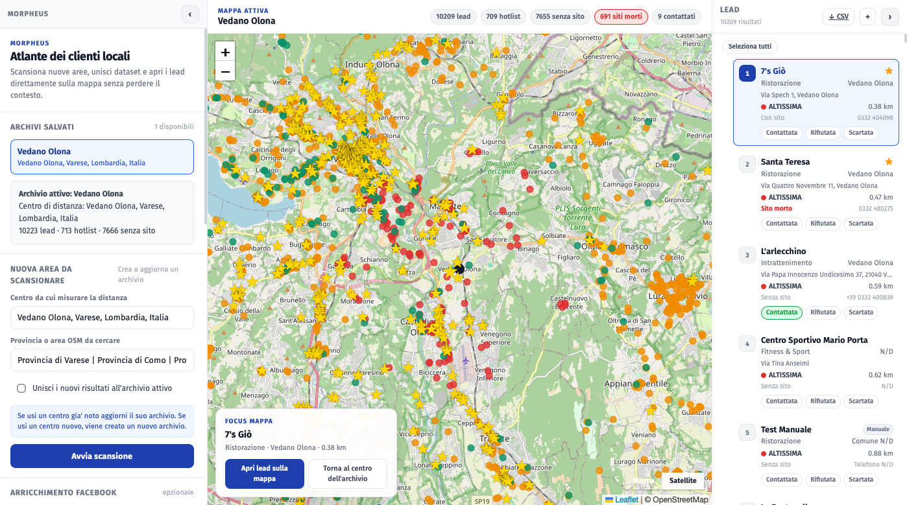

# Morpheus

[](LICENSE)
[](https://www.python.org/)
[](https://flask.palletsprojects.com/)
[](https://claude.com/claude-code)

> *"Morpheus ti mostra la verità."*



Migliaia di attività locali esistono, lavorano, hanno clienti. Online, però, non esistono: nessun sito, nessuna scheda Google, al massimo un profilo Facebook abbandonato nel 2017.

Sono **addormentate**. Morpheus le sveglia.

Il nome è un doppio omaggio: Morfeo greco, dio del sogno — perché queste attività dormono, digitalmente. E Morpheus di Matrix — perché il tool le tira fuori dal sonno e le mette davanti a chi può aiutarle.

Sotto il cofano: raccoglie dati da **OpenStreetMap**, **Foursquare** e **Google Places**, assegna a ogni attività uno score composito (distanza · assenza sito · categoria) e mostra tutto su una **mappa interattiva** pronta per l'outreach.

---

## Indice

- [Cosa fa](#cosa-fa)
- [Come funziona](#come-funziona)
- [Setup](#setup)
- [Avvio](#avvio)
- [Scoring](#scoring)
- [Interfaccia web](#interfaccia-web)
- [API Flask](#api-flask)
- [CLI](#cli)
- [Scoring LLM (opzionale)](#scoring-llm-opzionale)
- [Variabili d'ambiente](#variabili-dambiente)
- [Struttura del progetto](#struttura-del-progetto)
- [Stack](#stack)
- [Come è stato costruito](#come-è-stato-costruito)

---

## Cosa fa

| Feature | In due righe |
|---------|--------------|
| **Scansione OSM** | 16 query Overpass su 11 categorie merceologiche |
| **Foursquare** | POI aggiuntivi via `places-api.foursquare.com` (se hai la chiave) |
| **Google Places** | ~130 tipi verificati · grid search NxM su tutta la provincia · sito web e telefono inclusi |
| **Scoring composito** | Priorità basata su distanza + assenza sito + categoria target |
| **Score personalizzato** | Slider in-app per ribilanciare i pesi senza toccare il DB |
| **Filtro fonte dati** | Chip UI per vedere solo OSM / Foursquare / Google Places / Manuale |
| **Arricchimento Facebook** | Trova i profili pubblici via Brave + DuckDuckGo (~2 req/s) |
| **Verifica siti morti** | Check HEAD/GET in parallelo, badge sui domini scaduti |
| **Aggiunta manuale** | Incolla un URL Facebook o Google Maps, il resto lo estrae lui |
| **Bulk actions** | Selezione multipla, cambio stato, export CSV filtrato |
| **Dataset multipli** | Una scansione per area, unibili tra loro |
| **Job asincroni** | Scansioni in background, polling live, riprende dopo un refresh |
| **Navigazione frecce** | Con un lead aperto, ↑/↓ scorrono la lista senza toccare il mouse |

---

## Come funziona

```
1. Geocodifica      Nominatim risolve il punto di riferimento → lat/lon + bounding box provincia
2. Query Overpass   16 query OSM per categoria → attività grezze
3. Foursquare       Query circolare opzionale → POI aggiuntivi
4. Google Places    Grid NxM su bbox provincia · ~130 tipi (Table A ufficiale) · rankPreference=DISTANCE
5. Deduplicazione   Chiave (nome_slug, lat_3d, lon_3d) cross-source + seen_place_ids per cella
6. Scoring          Score composito [0,1] → fascia di priorità
7. CSV              Salvataggio in data/output/osm/runs/
8. Import DB        SQLite — preserva score LLM esistenti
9. Mappa            Leaflet con viewport culling e cluster per città
```

Un click parte la pipeline, che gira in background. Il frontend fa polling ogni 1.5s e aggiorna la mappa quando finisce.

### Google Places — grid search

Per coprire un'intera provincia senza restare vincolati al limite di 20 risultati per chiamata, Morpheus suddivide il bounding box Nominatim in una griglia NxM (default 3×2 = 6 celle). Ogni cella viene interrogata separatamente con raggio ridotto (`diagonale_cella / 2 × 1.3`, max 50 km). I `place_id` duplicati tra celle vengono scartati prima di salvare nel DB.

---

## Setup

**Serve:** Python 3.11+, Node.js 18+

```bash
# 1. Clona
git clone https://github.com/tuo-username/morpheus.git
cd morpheus

# 2. Ambiente Python
python3 -m venv .venv
source .venv/bin/activate      # Windows: .venv\Scripts\activate
pip install -r requirements.txt

# 3. Frontend
cd frontend
npm install
npm run build
cd ..

# 4. Variabili d'ambiente (tutte opzionali)
cp .env.example .env
```

---

## Avvio

```bash
# Metodo rapido
bash scripts/run_map.sh

# Oppure
.venv/bin/python3 app.py
```

Apri **http://localhost:5000**.

Al primo avvio il database è vuoto. Dalla UI:
1. Centro geografico (es. `Varese, Lombardia, Italia`)
2. Area OSM (es. `Provincia di Varese, Lombardia, Italia`)
3. Click su **Avvia scansione** — la mappa si popola in 2–5 minuti

---

## Scoring

Ogni attività riceve uno score composito **[0, 1]**:

```
score = (w_dist × dist_norm) + (w_sito × assenza_sito) + (w_cat × cat_target)
        ────────────────────────────────────────────────────────────────────────
                              w_dist + w_sito + w_cat

dist_norm    = max(0, 1 − distanza_km / max_distance_km)
assenza_sito = 1.0 se ha_sito = "NO", altrimenti 0.0
cat_target   = 1.0 se categoria è tra le target, altrimenti 0.0
```

Pesi di default: `w_dist = 0.5`, `w_sito = 0.3`, `w_cat = 0.2`

| Score | Priorità |
|-------|----------|
| ≥ 0.75 | **ALTISSIMA** |
| ≥ 0.55 | **ALTA** |
| ≥ 0.35 | **MEDIA** |
| ≥ 0.20 | **BASSA** |
| < 0.20 | **MOLTO BASSA** |

I pesi si ribilanciano in tempo reale dalla sidebar — il database resta intatto.

### Categorie rilevate

`Ristorazione` · `Ospitalità` · `Beauty & Benessere` · `Fitness & Sport` · `Sanità` · `Servizi Professionali` · `Artigiani` · `Negozi` · `Intrattenimento` · `Automotive` · `Formazione`

---

## Interfaccia web

```
┌─────────────────┬──────────────────────────────┬────────────────────┐
│   Sidebar       │         Mappa Leaflet         │   Lista lead       │
│                 │                               │                    │
│ · Dataset       │  Cluster per città (zoom <11) │ · Cards filtrabili │
│ · Nuova area    │  Marker individuali (zoom ≥11)│ · Stato outreach   │
│ · Facebook      │  Viewport culling + padding   │ · Bulk selection   │
│ · Siti morti    │                               │ · Export CSV       │
│ · Filtri mappa  │                               │ · +Aggiunta manuale│
│ · Score custom  │                               │ · ↑/↓ navigazione  │
│ · Fonte dati    │                               │                    │
└─────────────────┴──────────────────────────────┴────────────────────┘
```

**Aggiungere un'attività a mano:**
1. Click sul `+` in alto a destra nella lista
2. Incolla un URL Facebook o Google Maps → i dati si auto-compilano
3. Oppure scrivi tutto a mano
4. `📍 Geocodifica` ricava lat/lon dall'indirizzo
5. Salva — il lead compare subito in cima

**Filtro fonte dati:**
Chip nella sidebar per filtrare i lead per origine (`🗺 OSM`, `📍 Foursquare`, `🔍 Google`, `✏️ Manuale`). Selezionandone uno la mappa fa auto-fit sui lead di quella fonte.

**Navigazione da tastiera:**
Con un lead selezionato nella lista di destra, premi `↑` / `↓` per passare al precedente/successivo. La lista scorre automaticamente e la mappa si centra sul lead.

**Arricchimento Facebook:**
Cerca la pagina pubblica di ogni attività su Brave Search e DuckDuckGo, ~2 richieste/secondo, tollerante ai rate limit. I lead già processati (trovati o meno) non vengono ri-cercati.

---

## API Flask

| Endpoint | Metodo | Descrizione |
|----------|--------|-------------|
| `/api/datasets` | GET | Lista dataset con conteggi |
| `/api/datasets` | POST | Avvia scansione OSM + Foursquare (background) |
| `/api/datasets/<id>` | DELETE | Elimina dataset e tutti i lead |
| `/api/leads` | GET | Lead del dataset con filtri opzionali |
| `/api/leads` | POST | Crea lead manuale |
| `/api/leads` | PATCH | Bulk update (stato, hotlist, ecc.) |
| `/api/leads/<id>` | PATCH | Update singolo lead |
| `/api/leads/export` | GET | Export CSV con filtri correnti |
| `/api/leads/parse-url` | POST | Parsa URL Facebook/Google Maps → estrae nome, indirizzo, comune, coordinate |
| `/api/jobs/<id>` | GET | Stato job asincrono |
| `/api/geocode` | GET | Geocodifica via Nominatim |
| `/api/comuni` | GET | Lista comuni per autocomplete |
| `/api/datasets/<id>/enrich/facebook` | POST | Avvia arricchimento Facebook |
| `/api/datasets/<id>/check-sites` | POST | Avvia verifica siti morti |

**Filtri per `GET /api/leads`:**

| Parametro | Tipo | Descrizione |
|-----------|------|-------------|
| `dataset_id` | string | ID dataset (default: il più recente) |
| `priorita` | string/list | Es. `ALTISSIMA,ALTA` |
| `categoria` | string/list | Es. `Ristorazione` |
| `comune` | string | Substring case-insensitive |
| `solo_senza_sito` | bool | Solo attività senza sito |
| `solo_hotlist` | bool | Solo lead in hotlist |
| `page_size` | int | Default 50000, max 100000 |

---

## CLI

```bash
# Importa un CSV nel DB (se ne hai già uno)
.venv/bin/python3 scripts/importa_db.py

# Con parametri
.venv/bin/python3 scripts/importa_db.py \
  --reference "Busto Arsizio, Varese, Lombardia, Italia" \
  --append   # aggiunge senza sovrascrivere

# Query da terminale
.venv/bin/python3 scripts/cerca_lead.py --categoria ristorazione --limit 20
.venv/bin/python3 scripts/cerca_lead.py --priorita ALTISSIMA ALTA --senza-sito
.venv/bin/python3 scripts/cerca_lead.py --hotlist --output csv > hotlist.csv
.venv/bin/python3 scripts/cerca_lead.py --list-datasets
```

---

## Scoring LLM (opzionale)

Richiede [Ollama](https://ollama.ai) attivo in locale con `qwen2.5:3b` o `gemma2:2b`.

```bash
ollama pull qwen2.5:3b

.venv/bin/python3 scripts/scorizza_lead.py \
  --servizio "sito web professionale" \
  --limit 50
```

Assegna uno score 0–10 ai lead in hotlist in base alla rilevanza per il servizio specificato. Lo score finisce nel DB e compare sulla mappa.

---

## Variabili d'ambiente

Tutte opzionali. Copia `.env.example` in `.env` e compila ciò che serve.

| Variabile | Default | Descrizione |
|-----------|---------|-------------|
| `FSQ_API_KEY` | — | Foursquare Service API Key (da `foursquare.com/developer`). Senza, Foursquare viene saltato. |
| `GOOGLE_PLACES_API_KEY` | — | Google Places API Key (da GCP Console). Senza, Google viene saltato. |
| `GOOGLE_PLACES_ENABLED` | `1` | Kill-switch rapido: `0` disattiva Google anche con chiave presente. |
| `GOOGLE_PLACES_MAX_CALLS` | `200` | Cap chiamate Google per scansione (tipi × celle griglia). |
| `GOOGLE_PLACES_MAX_RESULTS` | `3000` | Cap risultati totali Google per scansione. |
| `GOOGLE_PLACES_GRID_COLS` | `3` | Colonne della griglia di ricerca sulla provincia. |
| `GOOGLE_PLACES_GRID_ROWS` | `2` | Righe della griglia di ricerca sulla provincia. |
| `SCORING_CATEGORIES` | — | Categorie target per `cat_target`. Es. `Ristorazione,Artigiani` |
| `SCORING_MAX_DISTANCE_KM` | `50` | Distanza massima per normalizzare `dist_norm` |

### Google Places — free tier e costi

Morpheus usa l'endpoint `searchNearby` della **Places API (New)**. Ogni chiamata è classificata come **Nearby Search Pro** (include `websiteUri`, `nationalPhoneNumber`).

**Chiamate per scansione (default 3×2):**
- ~130 tipi verificati × 6 celle griglia = fino a **~780 chiamate** per scansione completa di una provincia
- Il cap `GOOGLE_PLACES_MAX_CALLS = 200` limita la scansione a ~200 chiamate; alzalo se vuoi coprire tutti i tipi su tutte le celle

**Free tier Google Places API (New):**

| Metrica | Valore |
|---------|--------|
| Credito mensile gratuito | **5.000 richieste/mese** (Nearby Search) |
| Costo oltre il limite | ~$0.032 per chiamata |
| Scansioni/mese free (1 provincia, cap 200) | **~25** |
| Scansioni/mese free (1 provincia, tutte le celle, ~780) | **~6** |
| Scansioni/mese free (2 province, ~1.560) | **~3** |

Le env `GOOGLE_PLACES_MAX_CALLS` e `GOOGLE_PLACES_MAX_RESULTS` sono **hard cap** anti-sorpresa. Su `401`/`403` il client aborta immediatamente. Non aumentarli senza prima stimare il consumo in Google Cloud Console → Quotas.

---

## Struttura del progetto

```
morpheus/
├── app.py                        # Flask server, API REST, job asincroni
├── requirements.txt
├── .env.example
│
├── frontend/
│   ├── src/
│   │   ├── App.jsx               # Intera app React (mappa + sidebar + lista)
│   │   └── styles.css            # Design system completo
│   ├── package.json
│   └── dist/                     # Build produzione (gitignore)
│
├── scripts/
│   ├── run_map.sh                # Avvia Flask
│   ├── setup.sh                  # Setup ambiente Python
│   ├── importa_db.py             # Importa CSV nel DB SQLite
│   ├── cerca_lead.py             # Query CLI sul DB
│   └── scorizza_lead.py          # Scoring LLM via Ollama
│
├── src/morpheus/
│   ├── osm_finder.py             # MorpheusFinder — OSM + Foursquare + Google Places (grid)
│   ├── db.py                     # Tutte le operazioni SQLite (incl. colonna fonte)
│   ├── facebook_enrichment.py    # Ricerca profili Facebook pubblici
│   ├── site_checker.py           # Verifica raggiungibilità siti web
│   ├── url_parser.py             # Parsing URL Facebook/Google Maps + geocodifica
│   ├── llm_filter.py             # Scoring lead via Ollama
│   └── paths.py                  # Path centralizzate del progetto
│
└── data/
    ├── leads.db                  # Database SQLite (gitignore)
    └── output/
        └── osm/runs/             # CSV per ogni scansione (gitignore)
```

---

## Stack

| Strato | Tecnologia |
|--------|-----------|
| Backend | Python 3.11+ · Flask 3 |
| Database | SQLite (zero dipendenze esterne) |
| Geodati primari | OpenStreetMap via Overpass API |
| Geocodifica | Nominatim (OSM, gratuito) |
| Geodati secondari | Foursquare Places API v3 (opzionale) |
| Geodati terziari | Google Places API (New) · `searchNearby` · grid search (opzionale) |
| Ricerca Facebook | Brave Search + DuckDuckGo (scraping HTML) |
| Frontend | React 18 · Vite · Leaflet |
| Mappe satellite | Esri World Imagery (nessuna API key) |
| Scoring LLM | Ollama locale — `qwen2.5:3b` / `gemma2:2b` (opzionale) |

---

## Come è stato costruito

Morpheus è stato progettato e sviluppato da **[Marco Barlera](https://github.com/marcobarlera)** in coppia con **[Claude Code](https://claude.com/claude-code)** — l'agent CLI di Anthropic basato sul modello Claude Sonnet.

Non è "codice generato dall'AI": è un progetto nato da un'idea precisa, iterato su 8+ sessioni di pair programming in cui l'umano ha guidato direzione, architettura e product decisions, e l'agent ha contribuito su implementazione, refactoring, debugging e design system.

| Chi | Ruolo |
|-----|-------|
| [Marco Barlera](https://github.com/marcobarlera) | Ideazione, product design, direzione tecnica |
| [Claude Code](https://claude.com/claude-code) (Sonnet) | Pair programming — architettura, implementazione, debugging, UI |

Se ti incuriosisce il workflow, ogni sessione lascia una traccia nel git log.
